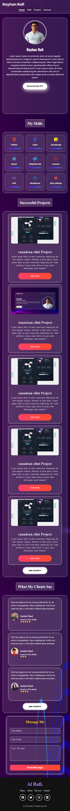

# 🌟 Ryhan Rafi — Developer Portfolio

A modern and responsive developer portfolio website built with **HTML5 and CSS3** featuring a clean glassmorphism-inspired design, smooth animations, and a professional layout to showcase my skills, projects, experience, and personal profile.

This portfolio is designed to provide a smooth user experience with a modern interface, responsive design, and easy customization.


---

## 📖 Table of Contents

- [Features](#-features)
- [Tech Stack](#-tech-stack)
- [Project Structure](#-project-structure)
- [Getting Started](#-getting-started)
- [Customization Guide](#-customization-guide)
- [Responsive Design](#-responsive-design)
- [Browser Support](#-browser-support)
- [Known Limitations](#-known-limitations)
- [Credits](#-credits)
- [License](#-license)

---

# ✨ Features

- **Modern Glassmorphism Design**
  - Beautiful glass effect cards
  - Soft glowing borders
  - Smooth animations
  - Modern dark theme interface

- **Responsive Navigation**
  - Sticky header
  - Smooth scrolling navigation
  - Mobile-friendly layout

- **Hero Section**
  - Personal introduction
  - Developer profile
  - Profile image showcase
  - Download CV button

- **Skills Section**
  - Display technical skills
  - Animated skill progress bars
  - Technology icons

- **Projects Showcase**
  - Responsive project cards
  - Project images
  - Project descriptions
  - View project buttons

- **Client Reviews Section**
  - Testimonial cards
  - Rating system
  - Reviewer information

- **Contact Section**
  - Modern contact form design
  - User-friendly input fields
  - Social media links

- **Fully Responsive**
  - Optimized for desktop
  - Tablet support
  - Mobile-friendly design

- **Performance Focused**
  - No unnecessary dependencies
  - Lightweight structure
  - Simple deployment process

---

# 🛠 Tech Stack

| Purpose | Technology |
|---------|------------|
| Structure | HTML5 |
| Styling | CSS3 |
| Layout | Flexbox |
| Responsive Design | CSS Media Queries |
| Icons | Font Awesome |
| Fonts | Google Fonts |

---

# 📁 Project Structure

```
portfolio/
│
├── index.html          # Main website structure
│
├── style.css           # Main styling, animations & design
│
├── responsive.css      # Responsive layouts for different devices
│
├── images/             # Website images
│
├── images/Preview      # Website Preview images
│
└── README.md
```

---

# 🚀 Getting Started

Follow these steps to run this project locally.

## 1. Clone Repository

```bash
git clone https://github.com/RyhanZone/Glass-Portfolio-version-2
```

Navigate into the project folder:

```bash
cd Glass-Portfolio-version-2
```

---

## 2. Run Project

This project does not require:

- npm install
- build tools
- framework setup

Simply open:

```
index.html
```

in your browser.

For a better development experience, you can use:

- VS Code Live Server Extension

---

# 🎨 Customization Guide

You can easily customize this portfolio according to your own needs.

## Change Personal Information

Edit:

```
index.html
```

Update:

- Name
- Description
- Skills
- Projects
- Contact information
- Social links


---

## Change Profile Image

Replace your image source inside:

```
index.html
```

with your own image path.

Example:

```html

```

---

## Customize Colors & Design

Edit:

```
style.css
```

You can modify:

- Background colors
- Gradient effects
- Glass effects
- Animations
- Font styles

---

## Add New Skills

Inside the skills section:

- Duplicate an existing skill card
- Change the icon
- Update skill percentage

---

## Add New Projects

Inside project section:

- Copy an existing project card
- Replace image
- Update title
- Add project description

---

# 📱 Responsive Design

The website is optimized for multiple screen sizes.

| Breakpoint | Device |
|------------|--------|
| 1024px | Laptop / Large Tablet |
| 768px | Tablet |
| 480px | Mobile |
| 360px | Small Mobile |

All responsive styles are handled inside:

```
responsive.css
```

---

# 🌐 Browser Support

Works smoothly on modern browsers:

- Google Chrome
- Microsoft Edge
- Firefox
- Safari

---

# ⚠️ Known Limitations

- Contact form is currently frontend-only.
- Download CV button needs to be connected with an actual CV file.
- Images should be replaced with personal assets before production deployment.

---

# 📸 Screenshots

Preview:

```md




```

---

# 🚀 Deployment

Since this is a static website, it can be deployed easily using:

- GitHub Pages
- Netlify
- Vercel
- Any static hosting platform

No backend or database setup is required.

---

# 🙏 Credits

Design inspiration:

- Modern Glassmorphism UI
- Developer portfolio layouts
- Minimal dark themed interfaces

---

# 📄 License

This project is licensed under the MIT License.

You are free to use, modify, and distribute this project.

---

# 👨‍💻 Author

## Ryhan Rafi

Fullstack Developer

Working with:

- HTML
- CSS
- SASS
- JavaScript
- React
- Tailwind CSS
- PHP
- Laravel
- WordPress

Portfolio:

https://rafirafi.com


---

⭐ If you like this project, consider giving it a star!